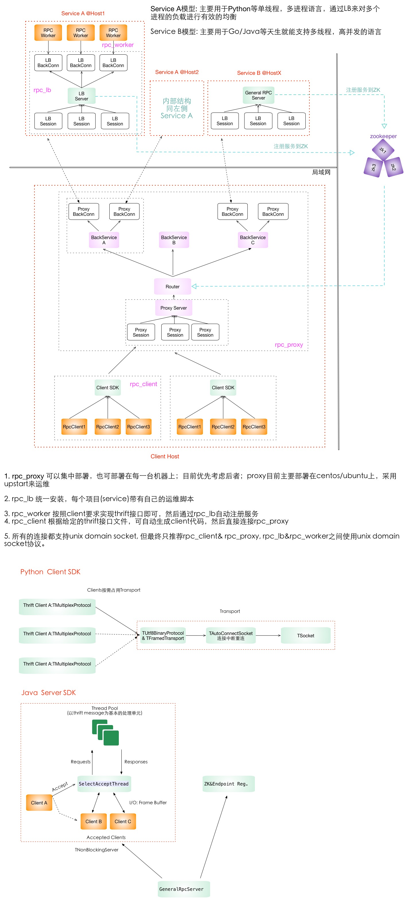

# rpc_proxy - A Thrift & Zookeeper-Based Distributed RPC Framework
基于Thrift和zookeeper的分布式RPC框架，能自动注册服务和发现服务；实现了基于Request的负载均衡；并针对Python做了负载均衡处理。

子项目:
* [rpc_proxy Java SDK](https://github.com/wfxiang08/rpc_proxy_java)
* [rpc_proxy Python SDK](https://github.com/wfxiang08/rpc_proxy_python)
* [rpc_proxy Dashboard](https://github.com/wfxiang08/rpc_proxy_dashboard)
* [rpc_proxy &Go SDK](https://github.com/wfxiang08/rpc_proxy)

## RPC的分层
rpc_proxy分为3到4层，从前端（服务消费者）往后端（服务提供者）依次标记为L1, L2, L3, L4

### L1层(应用层)
* 最前端的RPC Client, 主要由thrift中间语言生成代码
* 以python client为例，如: `thrift --gen py geolocation_service.thrift` 生成GeoClient的代码, 供Client直接调用

```python
# Transport层是所有的RPC服务都共用的
from rpc_thrift.utils import get_base_protocol, get_service_protocol
default_timeout = 5000
_ = get_base_protocol(settings.RPC_LOCAL_PROXY, timeout=default_timeout)
protocol = get_service_protocol(service="geolocation", logger=debug_logger)
_client_geolocation = GeoClient(protocol)

# 在IDE中能自动提示
result = _client_geolocation.GpsToGoogle(Locations(locations))
```


### L2层(Proxy层)
* Proxy在每台机器上都有部署，并通过linux upstart来进行管理。
* 服务的发现和负载均衡放在Client端赖做也会极大地增加了Client端的开发难度和负担，而Proxy将开发者从这些复杂的逻辑中解脱出来。
* Proxy层也有简单的负载均衡的处理
* `为了降低网络延迟，Proxy和本地的Client可以采用Unix Domain Socket通信`
* 运维，参考: scripts目录：
	* 配置好config.ini之后，可以使用: ./control_proxy.sh start/stop/tail等运维
	* 或linux upstart: start rpc_proxy, stop rpc_proxy， restart rpc_proxy

### L3层(负载均衡)
* Java/Go等天然支持多线程等，基本上不需要负载均衡, 因此这一层主要面向python
* 负责管理后端的Worker, 自动进行负载均衡，故障处理，以及Graceful Stop
* 负责服务的注册

```bash
## 配置文件
config.ini
zk=127.0.0.1:2181

# 线上的product一律以: online开头
# 而测试的product禁止使用 online的服务
product=test
verbose=0

zk_session_timeout=30

## Load Balance
service=typo
front_host=
front_port=5555
back_address=run/lb.sock

# 使用网络的IP, 如果没有指定front_host, 则使用使用当前机器的内网的Ip来注册
ip_prefix=10.

## Server
worker_pool_size=2

## Client/Proxy
proxy_address=127.0.0.1:5550

```
* 运维: `./control_lb.sh start/stop/restart/tail`


### L3层也可以直接就是Rpc服务层，例如:
* 对于go, java直接在这一层提供服务

```go
func main() {

	proxy.RpcMain(BINARY_NAME, SERVICE_DESC,
		// 默认的ThriftServer的配置checker
		proxy.ConfigCheckThriftService,

		// 可以根据配置config来创建processor
		func(config *utils.Config) proxy.Server {
			processor := gs.NewGeoLocationServiceProcessor(&alg.GeoLocationService{})
			return proxy.NewThriftRpcServer(config, processor)
		})
}
```

### L4层(Python Workers)
* 通过thrift idl生成接口, Processor等
* 实现Processor的接口
* 合理地配置参数
    * 例如: worker_pool_size：如果是Django DB App则worker_pool_size=1(不支持异步数据库，多并发没有意义，即便支持异步数据库，Django的数据库逻辑也不支持高并发); 但是如果不使用DB, 那么Django还是可以支持多并发的
    * 注意在iptables中开启相关的端口
* thrift只支持utf8格式的字符串，因此在使用过程中注意
    * 字符串如果是unicode, 一方面len可能和utf8的 len不一样，另一方面，数据在序列化时可能报编码错误

```python
class TypoProcessor(object):
    def correct_typo(self, query):
        return corrected_query

config_path = "config.ini"
config = parse_config(config_path)
endpoint = config["back_address"]
service = config["service"]
worker_pool_size = int(config["worker_pool_size"])

processor = Processor(TypoProcessor())
s = RpcWorker(processor, endpoint, pool_size=worker_pool_size, service=service)
s.connect(endpoint)
s.run()
```
* `为了降低网络延迟，Workers和LoadBalance(L3)可以采用Unix Domain Socket通信`

## 系统架构


